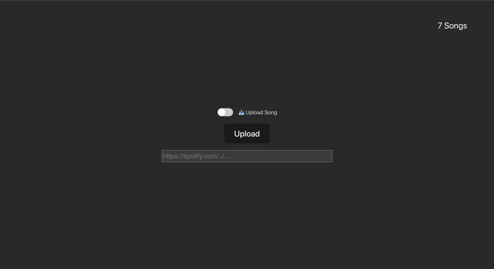
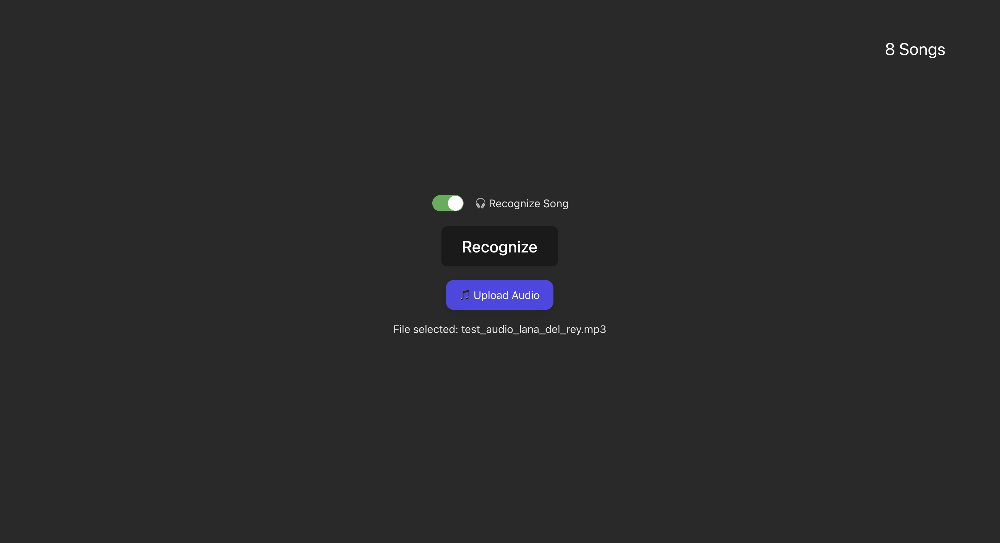
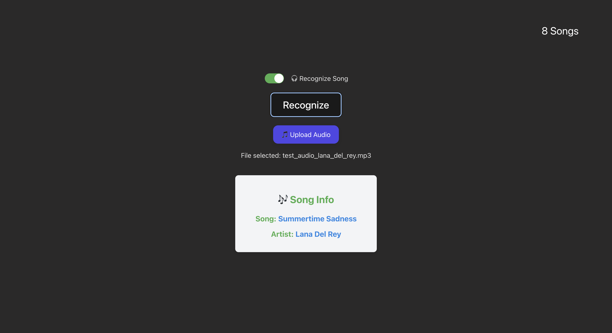

# 🎵 Music Recognition App

I built this app to explore how audio fingerprinting works in practice. It is essentially a simplified, self-hosted take on Shazam: you build a small music library from Spotify links, then upload a recording to see whether the system can recognize the track.

---

## How to Use It

The app has two modes that you can toggle between. Screenshots included in the repository show each step of this flow.

### 1. Building the Library (Upload Mode)



Switch to **Upload Mode** to add new songs to the database.

1. Paste a Spotify track link.
2. Submit the link.
3. The system:

   * Fetches basic metadata (artist and title).
   * Downloads the audio.
   * Generates a unique digital “fingerprint” from the sound.

Once processing finishes, the song is stored in the database and becomes available for recognition.

---

### 2. Identifying a Song (Recognition Mode)



Switch to **Recognition Mode** when you have an audio clip you want to identify.

1. Upload a `.wav`, `.mp3`, or `.ogg` file.
2. The app analyzes the sample, compares its fingerprint against the database, and returns the closest match.



---

## What’s Happening Under the Hood?

Audio fingerprinting is tricky because audio files cannot be compared directly, bit by bit. Instead, the app extracts distinctive sound patterns that stay relatively stable even if the recording quality changes.

A strong focus of this project is performance and responsiveness:

* **Rust + Rayon**: Rust is used for all performance-critical logic. Fingerprint computation is parallelized across CPU cores so heavy processing does not stall the system.
* **Async Backend**: The API is built with `actix-web` and `tokio`, allowing request handling and I/O to remain non-blocking.
* **Concurrent Pipeline**: Expensive audio analysis runs on worker threads, keeping the server responsive while processing files.

---

## The Stack

* **Core Logic**: Rust (fingerprinting algorithm, API, concurrency)
* **Frontend**: React
* **Database**: PostgreSQL
* **Audio Processing**: ffmpeg, yt-dlp
* **Observability & Performance**: Structured logging, Criterion benchmarks

---

## A Few Caveats

The recognition algorithm is still a work in progress. It performs well with clean, reasonably long recordings, but accuracy can drop when:

* The sample is extremely short (only a few seconds).
* There is significant background noise.
* The recording quality is very low.

---

## Getting Started

### Quickstart with Docker (Recommended)

```bash
docker compose up --build -d
```

Check server health:

```bash
curl http://localhost:8000/healthz
```

Open the app:

```
http://localhost:8000/
```

**Note**: Upload Mode requires Spotify credentials. Set `CLIENT_ID` and `CLIENT_SECRET` in a `.env` file before starting the server.

---

## Local Development

To run the project without Docker, make sure `ffmpeg` and `yt-dlp` are installed and available in your PATH.

**Backend**

```bash
cp .env.example .env
cargo run --bin shazam-server
```

**Frontend**

```bash
npm --prefix front-end install
npm --prefix front-end run dev
```

---

## License

MIT
